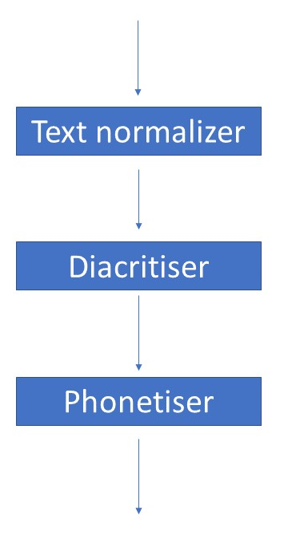
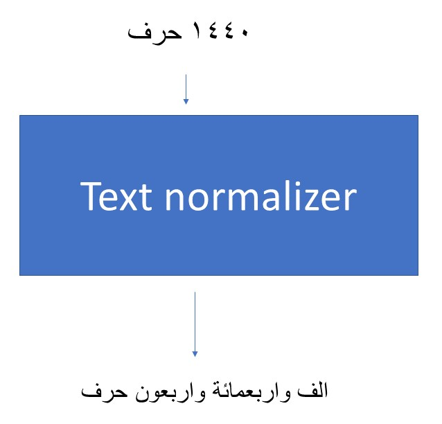
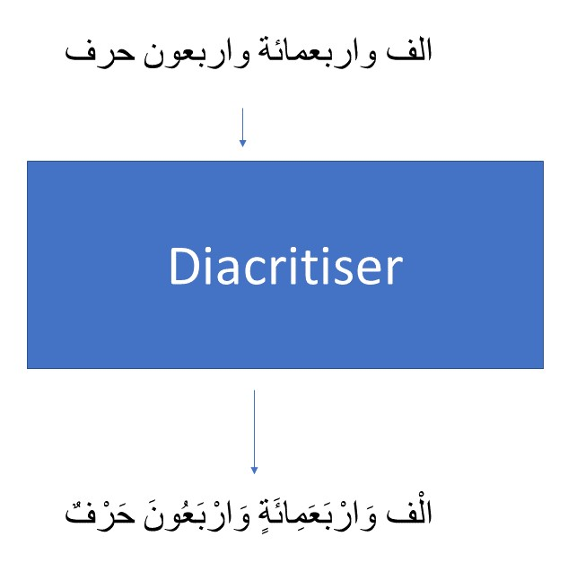
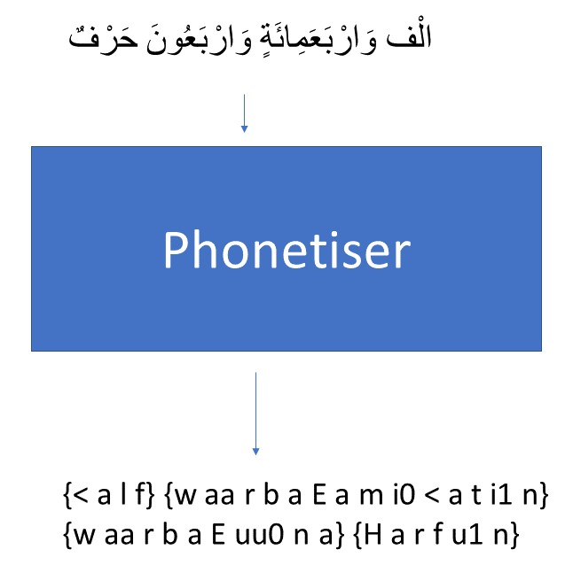

Text to speech synthesis is the process of converting a text string into a waveform. A conventional TTS system is usually made up of several
components connected through a pipeline that includes a front-end-text-analyzer and a backend speech synthesizer. Each of the front end and
backend is composed of several parts each performing one or more tasks. The front end is responsible for text analysis while the backend is responsible for converting features into audio.

The front end consists of text normalizers and a text-to-phoneme converter.
Text normalizers tokenize phrases and convert numbers and texts in the raw text into written words.
Text to phoneme converters takes the normalized text as an input and outputs phonemes which are symbolic representations of how the text is pronounced.

For an end to end speech synthesis system, the front end is limited to only text normalization, diacritisation, and phonetization.

## Text normalization

Text normalization is the first stage of processing done on the inputted text. Its job is to convert numbers, abbreviations and currency symbols to regular words.

## Diacritisation

The second stage of speech synthesis for the Arabic language is diacritisation.
The Arabic language has twenty-eight consonants, three short vowels, and
three long vowels. Long vowels are phonetically similar to short vowels except that they have a longer duration.
Short vowels are generally not considered within the word structure in Arabic orthography.
Arabic text could be diacritised or undiacritised.
Undiacritised text includes only consonants and long vowels.
Diacritised text includes consonants, long vowels, short vowels, and double consonants.
The figure below shows the difference in orthography between diacritised text and undiacritised text.

Most of the mainstream Arabic text is written without diacritics since readers usually pronounce words correctly as they could assume
the appropriate diacritics based on grammar, gender, context, etc.
Diacritics are crucial for appropriate pronunciation of a word.
Diacriticised Arabic orthography is close to phonemic representation.
As mentioned before, diacritics are dependent on grammar, gender, context, and other factors.
For a speech synthesizer to work appropriately diacritics are needed so that it could know how to pronounce words and here comes the role of the diacritiser.

## Survey for Available Diacritisers

There are several diacritisation tools in which each has its advantages and disadvantages.
Multilect which is a transliteration company offers diacritisation through a tool called Harakat.
Multilect's diacritisation is accurate, but it does not seem to offer bulk diacritisation for free.
The best diacritisation tools include Madamira, Farasa, and Camel Parser.
The issue with these diacritisation tools is their lack of accessibility for the open source community. Two popular open source diacritisers are Mishkal, a rule-based open source diacritiser and Shakkala which is a statistically based diacritiser that proved to be a better option in the open source community.

There is no clear winner as each tool has its advantages and disadvantages.

## Phonetisation

Phonetization is the process of converting graphemes into phonemes which are direct representatives
of audio sounds.
In non-phonetic languages like English, orthography characters do not always map directly to phonemes.
For example, the word "awesome" is converted to {AO1 S AH0 M}. Therefore, to have a phonetic representation for a word like "awesome" in English, phonetization is done manually. Also, the English language contains heteronyms, which are words with the same letters but are pronounced differently based on context.
For example, the word "desert" have different pronunciations based on the context.

This is not the case in the Arabic language which is highly phonetic.
For diacritised Arabic, a rule-based system could be used for phonetization. The best available graphemes-to-phonemes converter is [Arabic Phonetiser](https://github.com/nawarhalabi/Arabic-Phonetiser). [Arabic Pronounce](https://github.com/yoosif0/arabic_pronounce) is a wrapper for "Arabic Phonetiser" that allows it to be used as a service.

## Open Source Arabic End to End TTS

Check the repo for Arabic Tacotron TTS [here](https://github.com/yoosif0/arabic-tacotron-tts). Check also the samples for synthesized speech with only 2.41 hours of training data [here](https://github.com/yoosif0/arabic-tacotron-tts)
