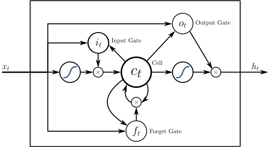

In the previous blog, we went through the different methods of speech synthesis. HTS systems were the best till the arrival of neural networks. In this blog, we would discuss different neural network text to speech systems. We will start by preliminary conventional deep neural networks (DNNs) until we reach the most advanced Bidirectional LSTMs.

## Why not HTS system?

Although most of the issues mentioned for HTS are solvable, HTS's inefficiency to represent complex context dependencies is still a significant hurdle.

There are about 50 different types of contexts including phonetic, linguistic, and grammatical contexts. Examples of contexts' features include POS(part-of-speech) labels of a word, binary features for categorical contexts, and numerical features for the numerical contexts, e.g., the number of words in a phrase.

Effective modeling of all of these contexts is challenging in HTS systems since HTS uses decision trees, which is not efficient in representing complex context dependencies such as multiplex problems, XOR, or parity.
For HTS systems to represent complex context dependencies, it would need to have huge decision trees which will require the fragmentation of training data which will result in overfitting and declined quality of synthesized speech, and this is where neural networks excel.

## Deep Neural Networks (DNNs)

Neural networks were used a long time ago but were not capable as it is today because they usually consisted of one hidden layer. The improvements that took place in hardware which enabled scientists to train large amounts of data with a higher speed allowed for an increasing number of hidden layers. As the number of hidden layers increased the
Replacing decision trees by deep neural networks (DNN) improves performance for TTS systems.

Conventional deep neural networks underperform due to its feed-forwarding nature. Long time span contextual effects in a speech utterance are not easy to learn. So here is where recurrent neural networks(RNN) outperform DNNs.

## Recurrent Neural Networks

The gradient vanishing problem in regular RNNs prevents them from learning long-term dependencies in sequential speech. Therefore, long
short-term memory (LSTM) networks could be used to solve this problem.

### Bidirectional LSTM

Now with regular RNNs and LSTM RNNs, neural network cells can have access to context unidirectionally in the backward direction(in the past only). So for example, for the sentence "I like to run", while the NN cells are synthesizing the speech for the word "run", it could access context for the word "like" since the word "like" comes before the word "run". On the other, while the NN cells are synthesizing the speech for the word "like", they can not access context for the word "run" since the word "run" comes after the word "like".

Since in text to speech systems, the whole sentence is given initially, we would also benefit from accessing context in the other direction. This fact makes a bidirectional LSTM much more beneficial than conventional unidirectional LSTMs for speech synthesis since they can capture information anywhere in the feature sequence. Previous experiments proved that hybrid BLSTM-RNN and DNN systems proved to be better than regular HMM and DNN systems for their ability to capture in-depth information in a network.

### End-to-end Systems

Modern text-to-speech (TTS) is not an effortless process due to several composite complexities in the pipeline.
Statistical parametric TTS usually have a text frontend extracting various linguistic features, a duration
model, an acoustic feature prediction model, and a complex, signal-processing-based vocoder.
These components require extensive domain knowledge. The figure below shows the complexities that arise with a conventional system.
Also, these pieces are trained independently so error from one process
could compound in the upcoming process in the pipeline.

Due to these issues, an end to end system is superior. An end to end system does not require extensive knowledge of linguistic features and does not require difficult engineering tasks that are necessary for regular statistical systems.

Another great benefit for an end to end speech synthesizer is that it could adapt quickly to high-level features like sentiment and tone of voice. Another advantage is that it could accustom itself easier to new data and generalize from one speaker to the next with a relatively short sample of any new voice.
