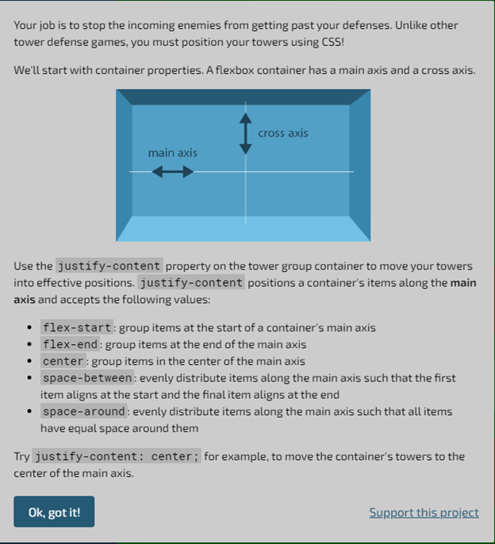
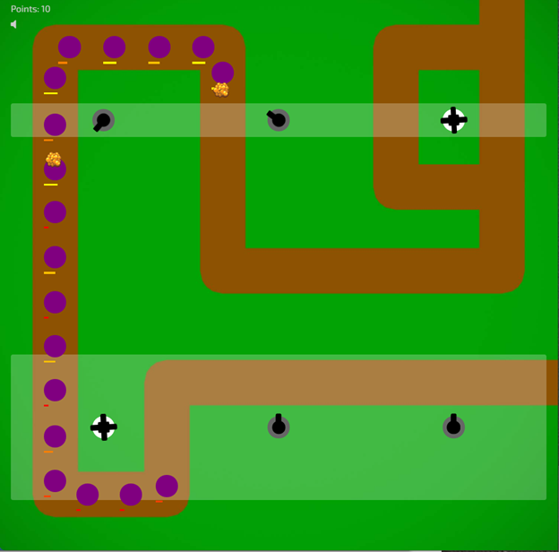

This article is a game review for [_Flexbox defense_](http://www.flexboxdefense.com/). This game teaches flexbox, a CSS's layout model. CSS is a language used for structuring and styling web pages. Flexbox is an intuitive layout model that CSS has recently used. A webpage's layout model defines the positioning of objects on the webpage.

**Gameplay**

Players must write code to move tower defenses to attack the enemies passing via the brown route. The tower defenses need to be close to the route so that gunshots are effective.

`gif:gif1.gif`

The game consists of 12 levels where the complexity of the code's complexity increases with each level. The player can click on a small badge anytime to view some technical knowledge helpful for the current level. The game starts with some instructions and technical info, as shown below.

After players are satisfied with the tower defenses position, they click on "Start Wave" to instantiate a simulation of the enemies coming and defense towers acting against it. While the simulation is running, players can not do anything in the game.

In intermediate and advanced levels, the number of enemies increases, and players have access to advanced tower defenses like the "super tower." Super towers attack in more than one angle simultaneously; therefore, they better be placed in regions that exploit this feature the most. The snapshot below displays that supertowers are in areas that expose a large surface area of the route.

**Game Themes**

I would consider this game to be a **casual** game since sessions are short. Players can stop playing after each session and come back later when convenient. The repeatability of this game is low. It does not make sense for someone to repeat a level after passing it since there is nothing new to learn.

The animation of the enemy's destruction after receiving many shots is **catchy** and makes me feel the dopamine hit. This **catchiness** provides some sort of **habituation**.
The image below shows the animation I mean.

`gif:gif2.gif`

The fact that the game is not time-bounded provides some **relaxation**. Besides this, players are not allowed to do anything while the simulation is running. This pause provides extra **relaxation** and acts as a break from coding. Play the video below to see the simulation.

<iframe width="560" height="315" src="https://www.youtube-nocookie.com/embed/dsWaPXU7m8E" frameborder="0" allow="accelerometer; autoplay; encrypted-media; gyroscope; picture-in-picture" allowfullscreen></iframe>

**Programming as a game**

I think that it is easy to develop games for programming since programming, like games, is mostly problem-solving. I believe that this game would have still been effective without the artificial layer that includes the enemies, the gunshots, and the route. Just testing the user's ability to move objects to specific regions via code is good enough and gives the dopamine hit too when solved. I think many people enjoy programming because they treat it as a challenge in a game that needs to be solved.

**Conclusion**

Not only I enjoyed the game and was eager to complete all levels, but I also learned something relevant to my profession. I would recommend this game to anyone who wants to learn flexbox in CSS. Indeed, being more effective in passing the game translates to better real-life skills in CSS coding.
